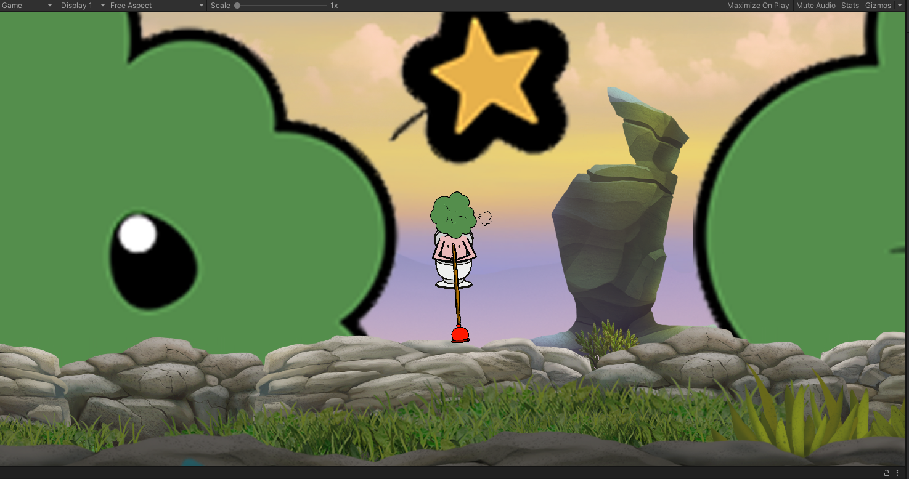

# 掘地菜升

原项目[rossning92](https://github.com/rossning92/getting-0ver-it) 

该项目为开源非盈利项目 属于哔哩哔哩直播间7194086 茜兰花 人设二创 人设已授权 主播相关资源文件属于粉丝福利二创

[相关直播间](https://live.bilibili.com/7194086)

## 使用环境

Windows&Android IOS再议

## 使用方法

### 直接使用

#### 静态托管

[itch.io](https://shdocter.itch.io/jdcs) 

#### 本地运行

从<s>[此处](http://154.83.12.247/files/Getting-0ver-It-With-Caihua.zip)</s>（停用）或者[Releases](https://github.com/SHDocter/Getting-0ver-It-With-Caihua/releases)下载 

<s>full目录为无边框全屏 windowed目录下的2K和1080P并不是指的窗口分辨率 而是指的显示器分辨率 

2K程序窗口实际分辨率为1920x1080 1080P程序窗口实际分辨率为1280x720 

因为编译问题 暂时只能无边框全屏 会在之后解决这个问题 或者自己编译时设定分辨率</s> 

目前可以在主菜单设置分辨率 更改分辨率后程序会在注册表里写入配置 下次会按照退出时的设定启动 

运行：双击目录下Getting-0ver-It-With-Caihua-vx.x-beta.exe文件 

退出：ALT+F4（窗口化可直接鼠标点击红×）或者按Esc键退出游戏

### 二次编译

clone源代码 

在unity中 file->Build Settings 根据自身需求修改配置和Player Settings 然后点击build 选择目录 

运行：双击选择的目录下xxx.exe文件 

退出：ALT+F4或者自己写的退出方式

## 关于项目

目前为1.2-beta版本 主菜单很简陋 没有设置 只有BGM 没有触碰音效 没有存档 关卡只有很简单的一关 后续会缓慢更新（注：关卡因为设计原因 目前不是重心）

## 更新日志

[更新日志](./UPDATELOG.md)